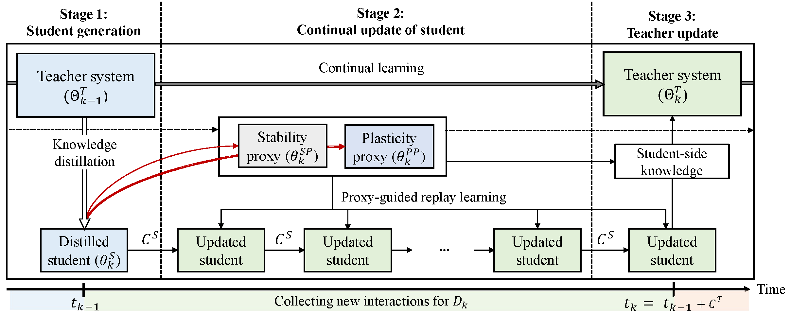
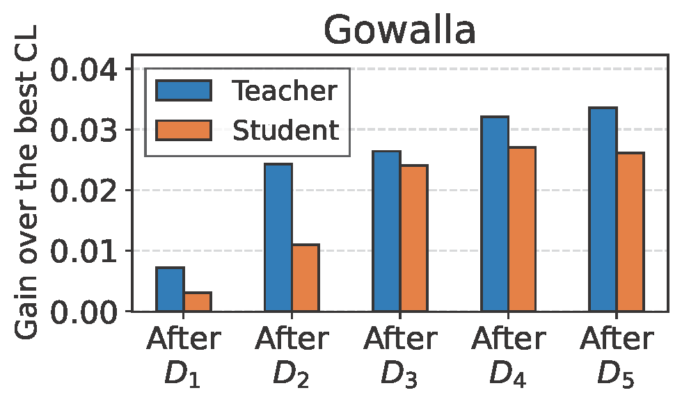
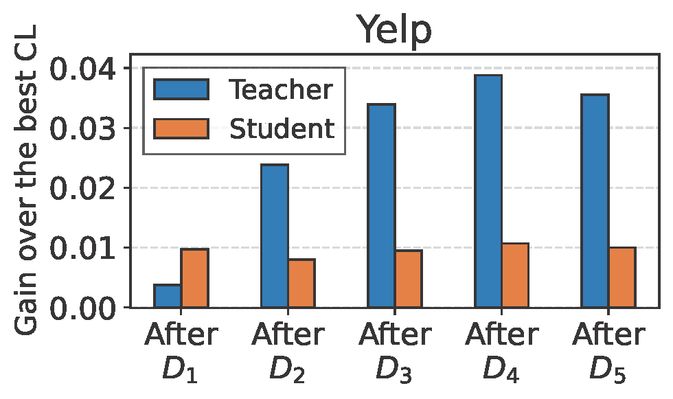

# Continual Collaborative Distillation for Recommender System (CCD)
This repository provides the source code of [Continual Collaborative Distillation for Recommender System](https://arxiv.org/abs/2405.19046) (CCD) accepted in KDD'24 as a research paper.

### 1. Overview
* This paper introduces an integrated framework combining knowledge distillation and continual learning for practical recommender systems. 
* This approach enables the collaborative evolution between the teacher and student models in dynamic environments, where nonstationary users, items, and interactions continuously come in through the data stream.
* Figure shows the overview of CCD framework for the $k$-th data block.


### 2. Main Result
**Collaborative evolution.** The figure shows the absolute H-mean gain of CCD over the best CL competitor using a GNN-based student. In CCD, the teacher and student mutually improve through knowledge exchange, progressively refining both models. This results in a growing performance gap between CCD and the CL competitor, demonstrating CCD's collaborative evolution.

<p align="center">
  
  
</p>

### 3. Dataset
We use the [Gowalla](https://snap.stanford.edu/data/loc-Gowalla.html) and [Yelp](https://www.yelp.com/dataset) dataset for our.experiments. We download the datasets from the official websites and place them in the `dataset` directory after preprocessing (e.g., K-core filtering and splitting each into a 50% base block ($𝐷_0$) & five incremental blocks ($𝐷1, ..., 𝐷5$)).


### 4. Installation
The code is written in Python 3.10.4 (see env.yml for details), using CUDA 11.7, pandas 1.5.3, and torch 1.13.1. To install the required packages, follow these steps:

```sh
# Clone the repository
git clone https://github.com/Gyu-Seok0/ccd.git
cd ccd

# Use conda
conda env create -f env.yml
conda activate ccd
```

### 5. Usage

Each data block should be executed in the following order. You can find an overview of our framework's entire execution in ./Run/run.sh.

```
Stage1: Student generation
python KD.py --d Yelp -m LightGCN_1 --tt 1 --max_epoch 10

Stage2. Continual update of student
python -u S_update.py --d Yelp -m LightGCN_1 --tt 1 --rl --US --UP --ab 50 --ss 1 --ps 0 --sw 1.0 --pw 0.1 --max_epoch 10

Stage3: Teacher update
    ** 3-1 Each teacher update **
    python -u T_update.py --d Yelp --student LightGCN_1 --teacher LightGCN_0 --tt 1 --rl --UCL --US --UP --ss 1 --ps 3 --cs 5 --max_epoch 10

    python -u T_update.py --d Yelp --student LightGCN_1 --teacher LightGCN_1 --tt 1 --rl --UCL --US --UP --ss 1 --ps 3 --cs 5 --max_epoch 10

    python -u T_update.py --d Yelp --student LightGCN_1 --teacher LightGCN_2 --tt 1 --rl --UCL --US --UP --ss 1 --ps 3 --cs 5 --max_epoch 10

    python -u T_update.py --d Yelp --student LightGCN_1 --teacher LightGCN_3 --tt 1 --rl --UCL --US --UP --ss 1 --ps 3 --cs 5 --max_epoch 10

    python -u T_update.py --d Yelp --student LightGCN_1 --teacher LightGCN_4 --tt 1 --rl --UCL --US --UP --ss 1 --ps 3 --cs 5 --max_epoch 10

    ** 3-2 Teacher system ensemble **
    python -u Ensemble.py --d Yelp --tt 1
```

### 6. Pretrained Weights
Due to their large size, we provide the weights of pretrained teacher and student models only for **Yelp** through another file-sharing system: [Google Drive link](https://drive.google.com/file/d/1F_2tSOAbHtABnqDxeZIrvkuVriXb32N4/view?usp=sharing).

### 7. Directory
```
📦CCD
 ┣ 📂Models
 ┃ ┣ 📜BPR.py
 ┃ ┣ 📜LWCKD.py
 ┃ ┣ 📜LightGCN.py
 ┃ ┗ 📜VAE.py
 ┣ 📂Run
 ┃ ┣ 📜Ensemble.py
 ┃ ┣ 📜KD.py
 ┃ ┣ 📜S_update.py
 ┃ ┣ 📜T_update.py
 ┃ ┗ 📜run.sh
 ┣ 📂Utils
 ┃ ┣ 📜data_loaders.py
 ┃ ┗ 📜utils.py
 ┣ 📂dataset
 ┃ ┣ 📂Gowalla
 ┃ ┃ ┣ 📜TASK_0.pickle
 ┃ ┃ ┣ 📜TASK_1.pickle
 ┃ ┃ ┣ 📜TASK_2.pickle
 ┃ ┃ ┣ 📜TASK_3.pickle
 ┃ ┃ ┣ 📜TASK_4.pickle
 ┃ ┃ ┣ 📜TASK_5.pickle
 ┃ ┃ ┣ 📜total_blocks_timestamp.pickle
 ┃ ┃ ┗ 📜user_D1_D5_only_list.pickle
 ┃ ┣ 📂Yelp
 ┃ ┃ ┣ 📜TASK_0.pickle
 ┃ ┃ ┣ 📜TASK_1.pickle
 ┃ ┃ ┣ 📜TASK_2.pickle
 ┃ ┃ ┣ 📜TASK_3.pickle
 ┃ ┃ ┣ 📜TASK_4.pickle
 ┃ ┃ ┣ 📜TASK_5.pickle
 ┃ ┃ ┣ 📜total_blocks_timestamp.pickle
 ┃ ┃ ┗ 📜user_D1_D5_only_list.pickle
 ┣ 📂figure
 ┃ ┣ 📜gowalla_gap.png
 ┃ ┣ 📜method.png
 ┃ ┗ 📜yelp_gap.png
 ┣ 📜README.md
 ┗ 📜env.yml
```

### 8. Citation
If you use this code or our method in your research, please cite our paper:

```bibtex
@misc{lee2024continual,
      title={Continual Collaborative Distillation for Recommender System}, 
      author={Gyuseok Lee and SeongKu Kang and Wonbin Kweon and Hwanjo Yu},
      year={2024},
      eprint={2405.19046},
      archivePrefix={arXiv},
      primaryClass={cs.IR}
}
```
